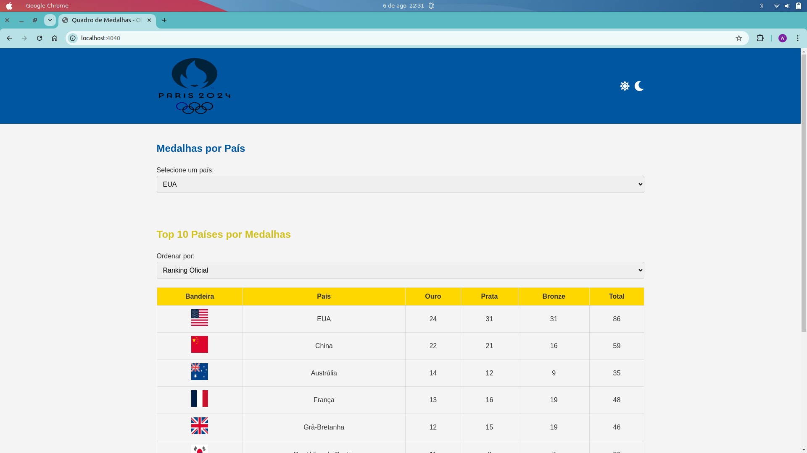
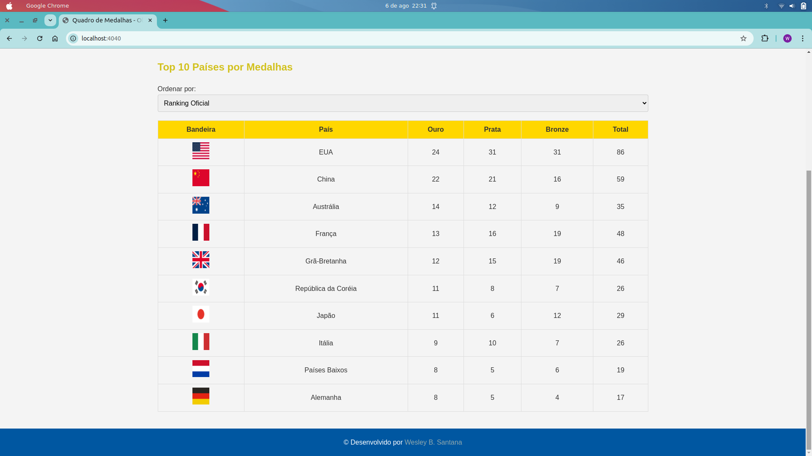
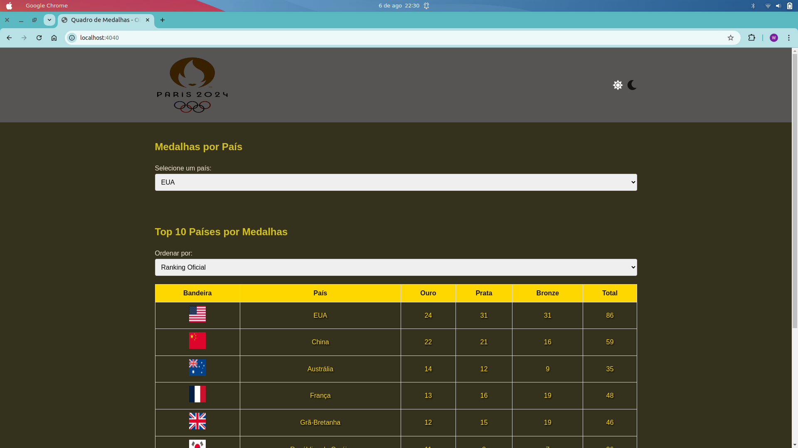

# Olympic Go


## Sobre o Projeto

Este projeto é um fork do repositório [mp-hackathon-olimpiadas](https://github.com/codante-io/mp-hackathon-olimpiadas). A ideia era consumir a API das Olimpíadas e usar a criatividade para desenvolver uma aplicação que exibam dados sobre a competição. O projeto exibe o quadro de medalhas dos Jogos Olímpicos, permitindo aos usuários filtrar por país e ver o top 10 países por medalhas. Também é possível alternar entre os temas claro e escuro.

## Tecnologias Utilizadas

- 
- 
- 
- 

## Funcionalidades

- Exibição do quadro de medalhas por país
- Exibição do top 10 países por medalhas
- Filtro de medalhas por país
- Alternância entre temas claro e escuro
- Responsividade

## Como Rodar o Projeto

1. Clone o repositório
    ```sh
    git clone https://github.com/WesleyBSa/mp-hackathon-olimpiadas.git
    ```
2. Navegue até o diretório do projeto
    ```sh
    cd olympic-go
    ```
3. Execute o main.go e acesse a porta 4040. (go run ./cmd/main.go)

## Estrutura do Projeto

```
.
├── assets
│ ├── css
│ │ └── styles.css
│ ├── img
│ │ └── olimpic-logo.png
│ └── js
│ └── script.js
├── cmd
│ └── main.go
├── internal
│ ├── controllers
│ │ └── medal_controller.go
│ ├── models
│ │ └── medal.go
│ ├── repositories
│ │ └── medal_repository.go
│ ├── routes
│ │ └── routes.go
│ └── services
│ └── medal_service.go
├── index.html
└── README.md
```

## Capturas de Tela

### Tela Inicial


### Quadro de Medalhas


### Tema Escuro


## Contato

Desenvolvido por [Wesley B. Santana](https://www.linkedin.com/in/wesley-batista-74b7a1198/)

[](https://github.com/WesleyBSa)
[](https://www.linkedin.com/in/wesley-batista-74b7a1198/)